# Lucrare de laborator nr. 5. Componentele de securitate

## Scopul lucrării
Familiarizarea cu bazele componentelor de securitate, cum ar fi autentificarea, autorizarea, protecția împotriva CSRF, precum și utilizarea mecanismelor integrate pentru gestionarea accesului. Studierea abordărilor dezvoltării sigure, inclusiv crearea rutelor protejate și gestionarea rolurilor utilizatorilor.

## Condiții
În această lucrare de laborator, veți implementa componentele principale de securitate, precum autentificarea, autorizarea, protecția rutelor și gestionarea de bază a rolurilor. În plus, veți configura mecanismul de resetare a parolei și veți explora logarea acțiunilor utilizatorilor.

## Sarcina Nr. 1. Autentificarea utilizatorilor
1. Creați un controller AuthController pentru gestionarea autentificării utilizatorilor.
2. Adăugați și implementați metodele pentru înregistrarea, autentificarea și deconectarea utilizatorului:
    - register() pentru afișarea formularului de înregistrare.
    - storeRegister() pentru procesarea datelor din formularul de înregistrare.
    - login() pentru afișarea formularului de autentificare.
    - storeLogin() pentru procesarea datelor din formularul de autentificare.
3. Creați rute pentru înregistrarea, autentificarea și deconectarea utilizatorului.
4. Actualizați vizualizările pentru formularele de înregistrare și autentificare.
5. Creați o clasă separată Request pentru validarea datelor de înregistrare sau autentificare sau adăugați validarea direct în controller.
6. Verificați dacă înregistrarea și autentificarea utilizatorului funcționează corect.
Controller:\
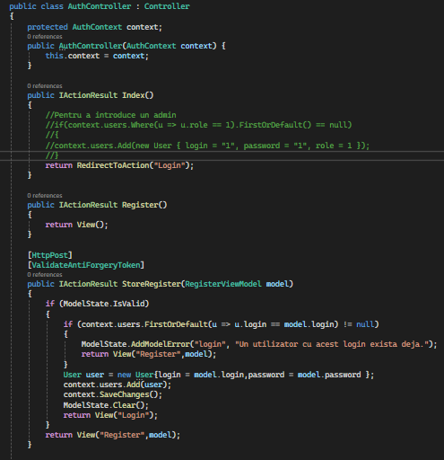\
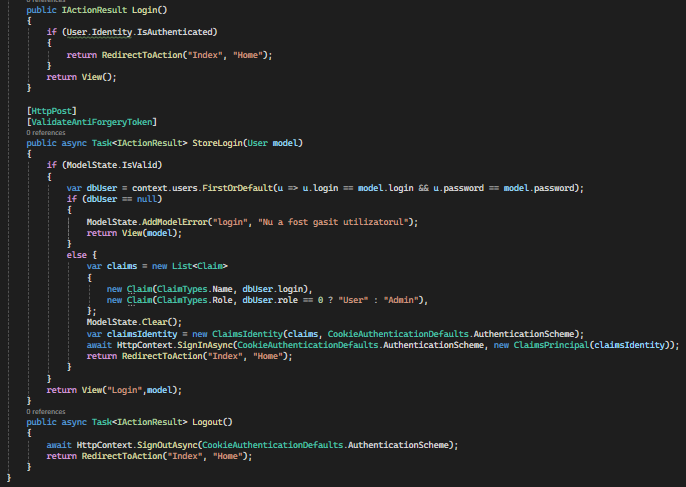

Vizualizarea Login:\
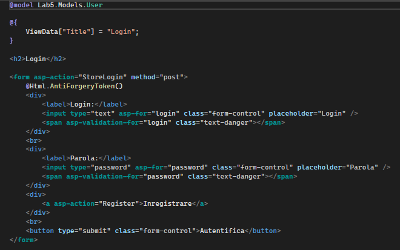\
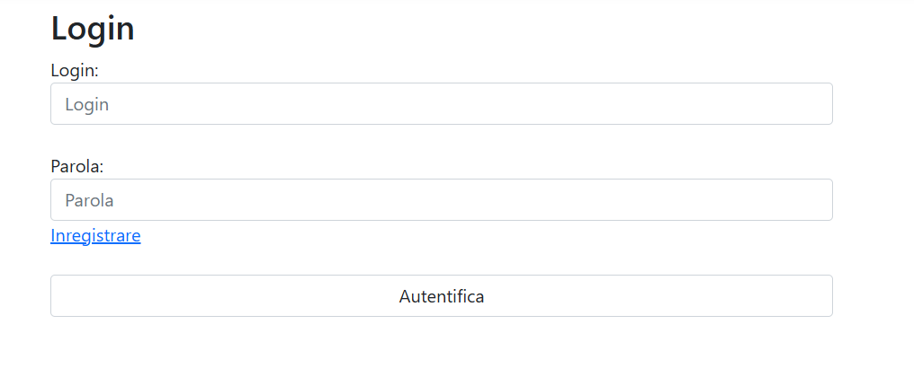

Vizualizarea Inregistrare:\
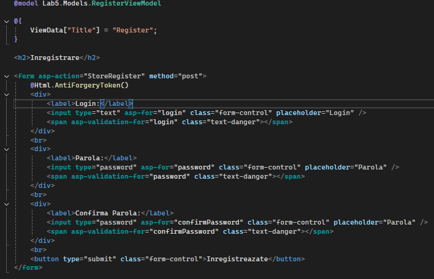\
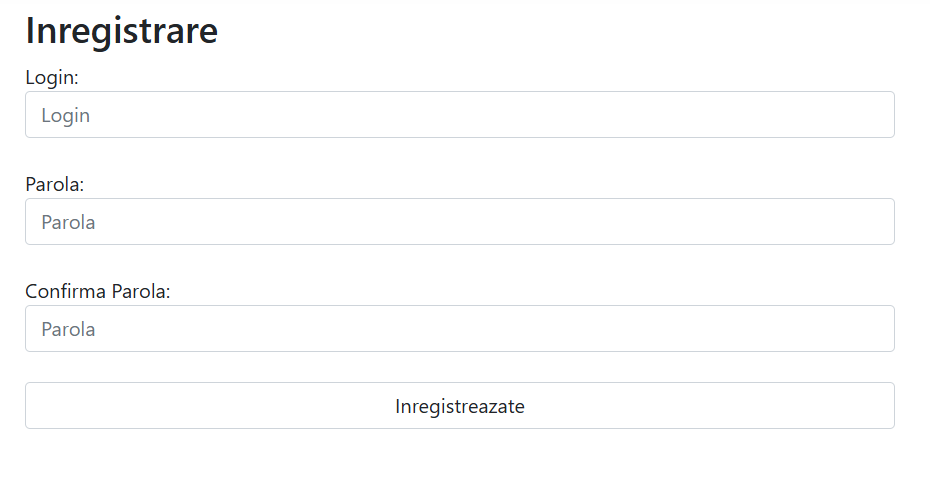

Clasa cu datele validate:\
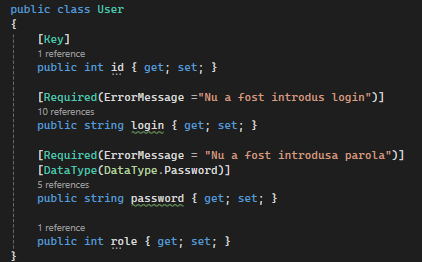\
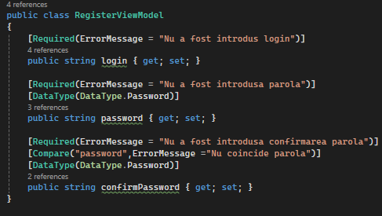

## Sarcina Nr. 2. Autorizarea utilizatorilor
1. Implementați o pagină „Panou personal”, accesibilă doar utilizatorilor autentificați.\
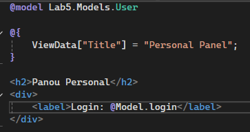\
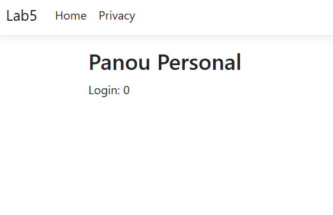

2. Configurați verificarea accesului la această pagină, adăugând middleware-ul auth în rută sau implementând verificarea în controller.
Accesibilitatea pagină este implementată prin:\
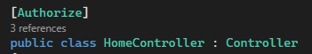

3. Actualizați vizualizarea paginii „Panou personal” pentru a afișa informațiile disponibile exclusiv utilizatorilor autentificați.
Reprezentat în punctul 2.1.

## Sarcina Nr. 3. Rolurile utilizatorilor
1. Adăugați un sistem de roluri: Administrator și Utilizator.

2. Configurați comportamentul pentru fiecare rol:
    1. Administrator: are posibilitatea de a vizualiza panourile personale ale tuturor utilizatorilor.
    
    2. Utilizator: poate vizualiza doar propriul panou personal.
    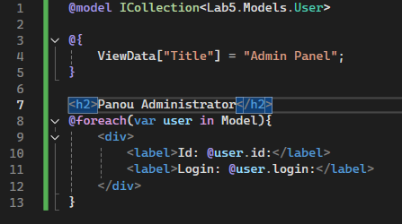\
    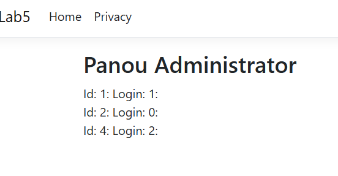

3. Implementați verificările rolurilor folosind metoda can, Gate sau middleware, pentru a asigura distribuirea corectă a drepturilor de acces.\
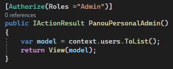

## Sarcina Nr. 4. Deconectarea și protecția împotriva CSRF
1. Adăugați un buton pentru deconectarea utilizatorului pe pagină.
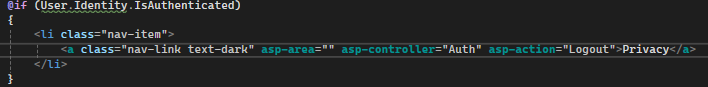\
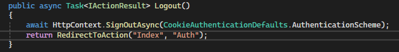

2. Asigurați protecția împotriva atacurilor CSRF pe formulare.
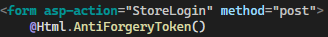\
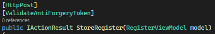

3. Verificați că deconectarea utilizatorului funcționează corect și sigur.
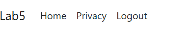